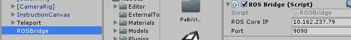

ROSBridge
=========

ROS overview
^^^^^^^^^^^^

The ROSBridge is a main part of this project as it connects the Unity project on Windows and the simulation
on Ubuntu. We recommend to have a look at the tutorials `here <http://wiki.ros.org/ROS/Tutorials>`_ to get a basic understanding
of ROS. The short version follows below.

The ROS core establishes connections between clients and creates topics.
Topics are similar to a public blackboard, where entities can decide to publish - write on the blackboard, or subscribe - read from it.

Publisher
---------

The publisher **sends** message over **one** topic. When you create the publisher you have to announce to ROS which type of message is to be sent as well as the name of the topic over which it is sent.  Therefore at first you have to advertise the new publisher with providing this information. Afterwards you can publish
data with the defined message type.

Subscriber
----------

A subscriber *receives* data from one topic. The topic name as well as the message type need to be defined and announced to the ROS server as was previously the case for teh publisher. 

Every time a message is published, the subscribing entities receive these. A CallBack function is triggered which handles the received data **Note: this is handled using threads**. Here, it can parse the message and process it.

Service
-------

A service works differently compared to the publisher and subscriber pattern. It serves like function call in which the the service is invoked via a topic. This means that you as the *service client* call the *service server* with the required data depending on the certain service via a *service request*. Then the server responds to you via a
*service response*. This is useful when you need to do certain tasks only on rare occasions e.g. reset a world.

Messages
--------
To communicate the necessary information, different standard or already defined messages can be chosen, addiitionally, new messages can be defined. As the communication is between a Ubuntu side and a Windows computer using a ROSBridge as a mediator, messages must to be defined on both sides and need to match exactly. 

**Messages for the simulation**
Examples can be found in the previously mentioned tutorials. The conversion from the message type to the `YAML format <https://en.wikipedia.org/wiki/YAML>`_, which is used by ROS, is automatically applied when implementing simulations and plugins using the designated libraries. The message needs to be defined in an extra file and its path must be sourced, so that ROS is able to find and use the message type.

**Messages in Unity**
In Unity, messages need to be converted manually. Looking at all custom messages defined in Unity gives a good insight into the structure and construction of messages. A ToYAMLString() method for each message type is defined, to parse the given message into a format expected and accepted by ROS. On the other side, messages which arrive at the Unity side need to be parsed so that these can be further processed. 

**Important**

Gazebo and Unity have different coordinate systems, therefore, to avoid confusion and missing or superfluous conversions, **outgoing coordinates and rotations must be translated into the Gazebo coordinate space**, while **incoming messages must be parsed to Unity coodrinate space**. It is sufficient to only implement constructors and ToYamlString() parser, in case messages of this type are only designed to be published.

.. code-block:: c#

  public override string ToYAMLString()
  {
	  // format the message ... 
      return string_in_yaml_format;
  }

Respectively, messages which will only ever be received only need to define a function which parses the messages into the correct format, as can be seen below. 

.. code-block:: c#

  public CustomMessage(JSONNode msg)
  {
      // parse message here
  }

Wrap-Up
-------

**Messages**
To define a custom message: 

1) Define and source the message on Ubuntu side
2) Create a class for the message on Windows side: Derive the message class from *ROSBridgeMsg* so the ROSBridge knows that this is a message. Implement the constructor and/or the ToYAMLString method depending on the purpose. 

**Subscribers/Publishers/Services**
With a newly created message, create a subscriber, publisher or or a service for this message type and a given topic name. To implement this on the Ubuntu side, just follow the tutorial.

In Unity, a new subscriber/ publisher / service needs to be defined. Each of this ros types have different requirements to be valid but each of these have to derive from the corresponding base class, e.g. CustomPublisher : ROSBridgePublisher

The publisher needs to have:

1) GetMessageType()
2) GetMessageTopic()

The subscriber needs to have:

1) CallBack()
2) GetMessageType()
3) GetMessageTopic()
4) ParseMessage()

The service needs to have:

1) ServiceCallBack

All methods must be public and static. If you forget to implement one of these the ROSBridge will throw an expcetion
which tells you which method is missing.

Wrapper
^^^^^^^

Originally we got the template from `this git project <https://github.com/michaeljenkin/unityros>`_. To make it more
usable and developer-friendly we wrote a wrapper. The Wrapper consists of two main classes.

**ROSObject**

A ROSObject retrieves all ros subscrivers, publishers and services which are components of the same gameObject. These are communicated to the *ROSBridge* to announce all entities on start-up and remove all entities when disabling this ROSObject.

**ROSBridge**

The ROSBridge is the main part of the wrapper. It forwards the needed calls to *ROSBridgeWebsocketConnection* which establishes a websocket and is the actual backend.

Scene Setup
^^^^^^^^^^^

When you created your custom publishers etc. and messages you need to edit your scene such as the ROSBridge is informed of these. First a ROSBridge prefab must be present in the scene (either drag and drop or create a custom version). Enter the IP adress and port of the ROS server to which you want to connect.

	
	ROSBridge

Attach the ROSObject script to the game object which also holds the subscriber, publisher and / or service components. 

.. figure:: ../images/ros_object.png
	:align: center
	:alt: ROSObject
	
	ROSObject

Now, all publishers and subscribers should automatically be registered and announced as well as removed according to the ROSObject state. 